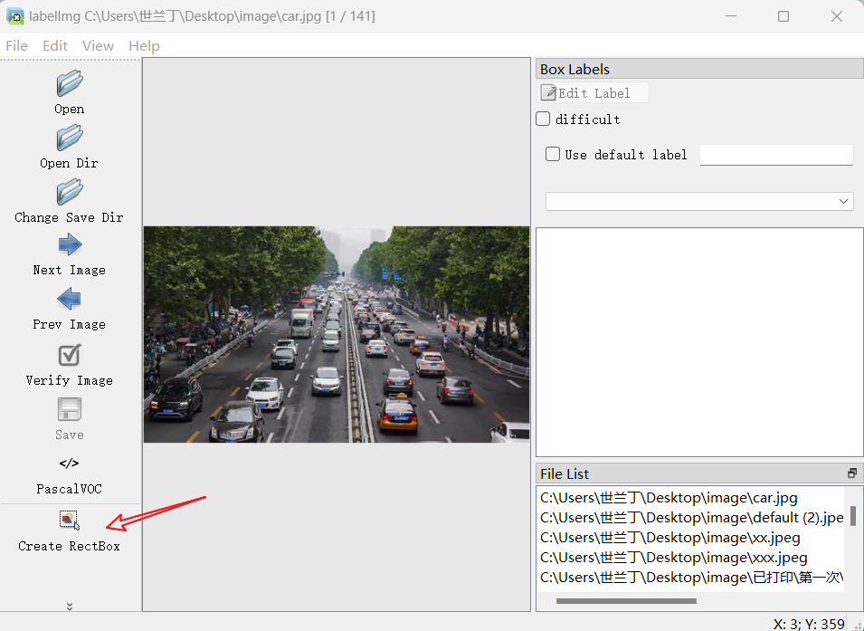
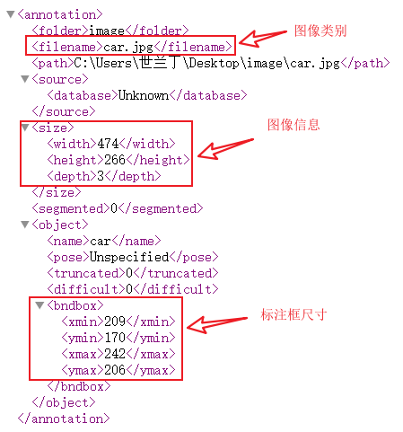
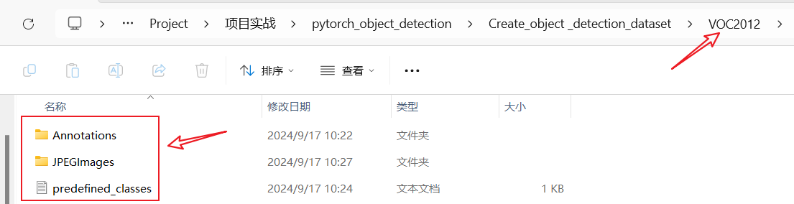

# create object detection dateset
We will use labelImg to achieve it ！

## （1）**configurate environment**
- 安装 Anaconda  
（Install anaconda）

- 创建一个叫 labelimg 的环境，你也可以自定义命名。  
（Create an environment named labelimg,you can customize the name.）

- 激活 labelimg 环境，并使用 `pip install labelImg` 安装 labelImg ，会自动安装关联的模块，比如 pyqt 和 lxml 。  
（Activate the environment,and use `pip install labelImg` to install labelImg,The associated modules will be automatically installed,such as pyqt and lxml.）

- 在命令行执行 labelImg 即可打开 labelImg 的页面。  
（Execute labelImg on the command line to open the labelImg page.）

## （2）**labelImg 的使用**
labelImg界面如下图。

选择一个文件夹打开图片，点击上图箭头处在图中标注矩形框，标注完成后即可点击 `save` 保存标注的文件，也可在界面最顶端的 `view` 中打开自动保存。  

注意需要预先创建好文件夹以保存标注得到的 `xml` 类型文件。xml 文件保存的信息如下图，一幅图标注了几个目标就有几组标注框尺寸。

## （3）**注意事项**
1. **预先创建文件夹用来保存图像和标注文件**。  
首先准备需要打标注的数据集。  
建议新建一个名为 VOC2012 的文件夹（这个是约定俗成，也可自定义），里面创建一个名为 JPEGImages 的文件夹存放需要打标签的图像；  
再创建一个名为 Annotations 存放标注得到的标签文件， labelImg 得到的标签文件是 xml 格式；  
最后创建一个名为  predefined_classes.txt 的 txt 文件来存放所要标注的类别名称，（在里面输入类别，一个类别占一行。）该文件可有可无，在类别较多时较方便。
目录如下图。

    

2. 打开 Anaconda promp ，激活一个下载好 labelImg 的环境，然后使用 `cd .....\VOC2012` 打开VOC2012文件夹，具体路径 `.....\VOC2012` 根据实际设置。

3. 执行 `labelImg JPEGImages predefined_classes.txt` ，意思是打开labelImg工具、打开JPEGImages文件夹、初始化predifined_classes.txt里面预定义的类名。

4. 然后打开 JPEGImages 文件夹即可标注图片。保存路径选择 VOC2012 里面的 Annotations 。标注完成后可在 Annotations 文件夹中看到保存的 `.xml` 格式文件。

5. 图像全部标注完成后还需划分训练集和验证集，可自行实现。