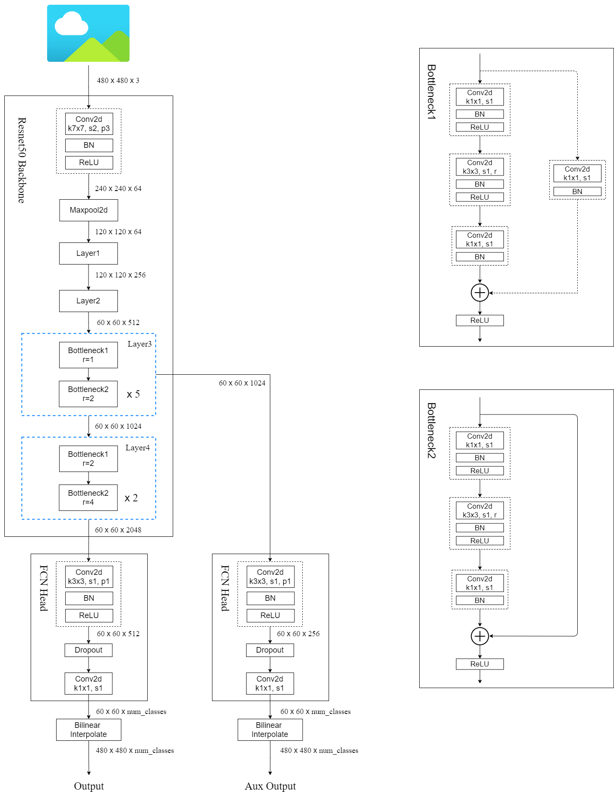

# FCN(Fully Convolutional Networks for Semantic Segmentation)

## 该项目主要是来自 pytorch 官方 torchvision 模块中的源码
* https://github.com/pytorch/vision/tree/main/torchvision/models/segmentation

## 环境配置：
* Python3.6/3.7/3.8
* Pytorch1.10
* Ubuntu 或 Centos (Windows 暂不支持多 GPU 训练)
* 最好使用 GPU 训练
* 详细环境配置见```requirements.txt```

## 文件结构：
```
  ├── src: 模型的 backbone 以及 FCN 的搭建
  ├── train_utils: 训练、验证以及多 GPU 训练相关模块
  ├── my_dataset.py: 自定义 dataset 用于读取 VOC 数据集
  ├── train.py: 以 fcn_resnet50 (这里使用了 Dilated/Atrous Convolution )进行训练
  ├── train_multi_GPU.py: 多 GPU 训练
  ├── predict.py: 使用训练好的权重进行预测
  ├── validation.py: 利用训练好的权重验证/测试数据的 mIoU 等指标，并生成 record_mAP.txt 文件
  └── pascal_voc_classes.json: pascal_voc 标签文件
```

## 预训练权重下载地址：
* 注意：官方提供的预训练权重是在 COCO 数据集上预训练得到的，训练时只针对和 PASCAL VOC 相同的类别进行了训练，所以类别数是21(包括背景)

* fcn_resnet50: https://download.pytorch.org/models/fcn_resnet50_coco-1167a1af.pth

* fcn_resnet101: https://download.pytorch.org/models/fcn_resnet101_coco-7ecb50ca.pth

* 注意，下载的预训练权重记得要重命名，比如在train.py中读取的是```fcn_resnet50_coco.pth```文件，
  不是```fcn_resnet50_coco-1167a1af.pth```
 
 
## 数据集，本例程使用的是PASCAL VOC2012数据集
* Pascal VOC2012 train/val数据集下载地址：http://host.robots.ox.ac.uk/pascal/VOC/voc2012/VOCtrainval_11-May-2012.tar

* 如果不了解数据集或者想使用自己的数据集进行训练，请参考: https://blog.csdn.net/qq_37541097/article/details/115787033

## 训练方法
* 确保提前准备好数据集

* 确保提前下载好对应预训练模型权重

* 若要使用单 GPU 或者 CPU 训练，直接使用 train.py 训练脚本

* 若要使用多 GPU 训练，使用```torchrun --nproc_per_node=8 train_multi_GPU.py```指令,```nproc_per_node```参数为使用 GPU 数量

* 如果想指定使用哪些 GPU 设备可在指令前加上```CUDA_VISIBLE_DEVICES=0,3```(例如我只要使用设备中的第 1 块和第 4 块 GPU 设备)

* ```CUDA_VISIBLE_DEVICES=0,3 torchrun --nproc_per_node=2 train_multi_GPU.py```

## 注意事项
* 在使用训练脚本时，注意要将 '--data-path'(VOC_root) 设置为自己存放 'VOCdevkit' 文件夹所在的 **根目录**

* 在使用预测脚本时，要将 'weights_path' 设置为你自己训练生成的权重路径。

* 使用 validation 文件时，注意确保你的验证集或者测试集中必须包含每个类别的目标，并且使用时只需要修改 '--num-classes'、'--aux'、'--data-path' 和 '--weights' 即可，其他代码尽量不要改动。

## FCN原理可参考bilibili
* https://www.bilibili.com/video/BV1J3411C7zd
* https://www.bilibili.com/video/BV1ev411u7TX

## FCN代码的分析可参考bilibili
* https://www.bilibili.com/video/BV19q4y1971Q

## Pytorch官方实现的FCN网络框架图


